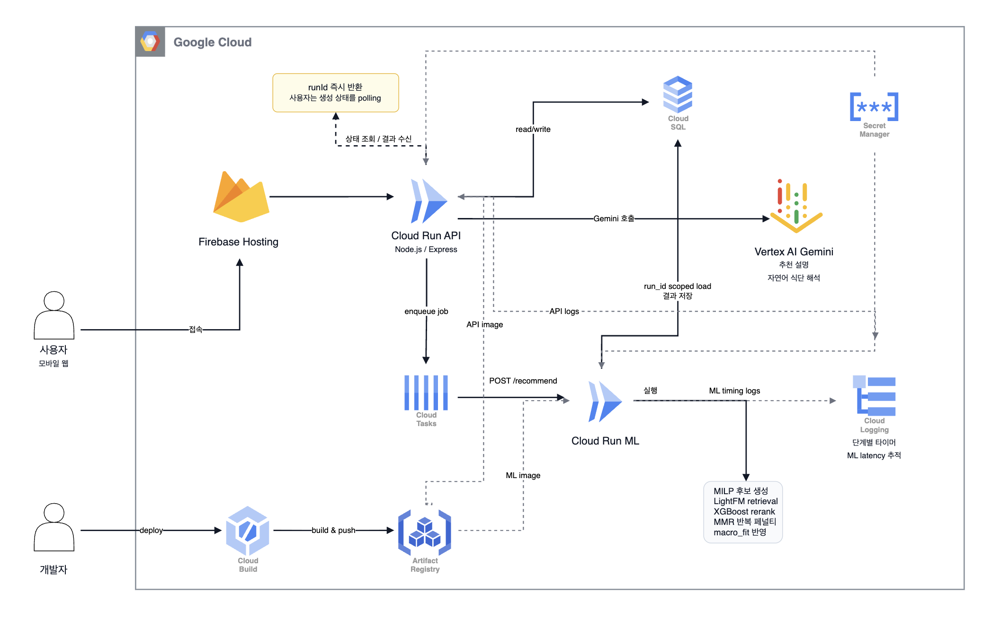
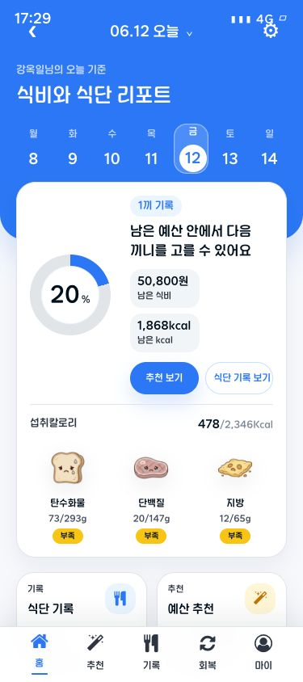
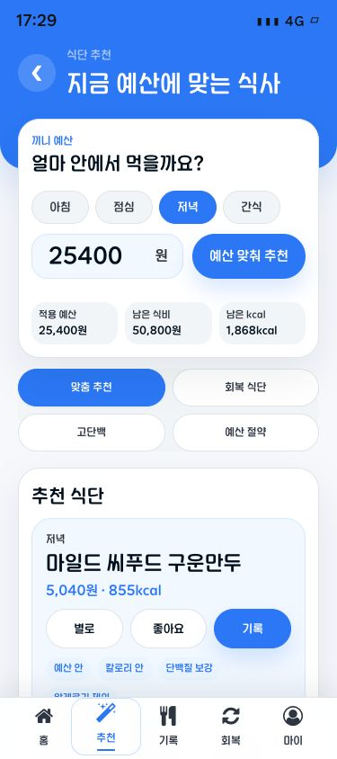
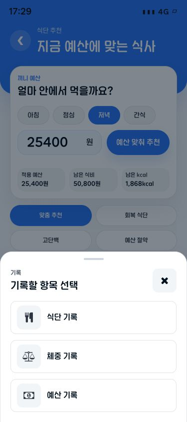
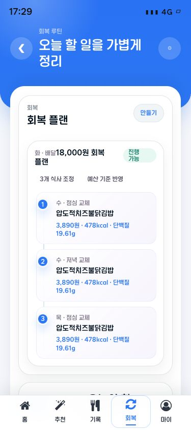
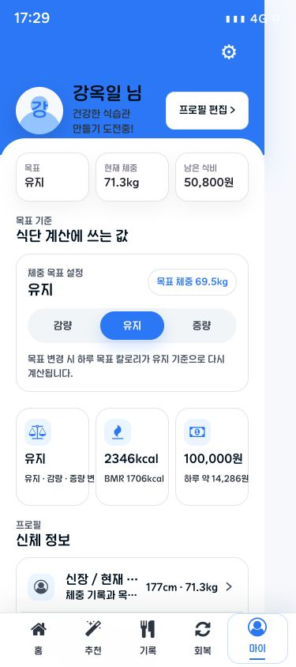

# Ecobi

> GCP 기반 예산 맞춤 식단 추천 서비스

Ecobi는 남은 칼로리와 주간 식비 예산을 함께 계산해 사용자가 오늘 선택할 수 있는 식사를 추천하는 모바일 웹 애플리케이션입니다. 저는 PM으로 문제 정의와 역할 조율을 맡고, Firebase Hosting, Cloud Run API/ML, Cloud Tasks, Cloud SQL로 이어지는 GCP 아키텍처와 풀스택 구현을 주도했습니다.

## Tech Stack

**Frontend**


**Backend / ML**


**Google Cloud**


## Architecture



1. 사용자는 Firebase Hosting으로 배포된 React 모바일 웹에 접속합니다.
2. 프론트엔드는 Firebase rewrite를 통해 Cloud Run API의 `/api/v1/**` 엔드포인트를 호출합니다.
3. Cloud Run API는 `recommendation_runs`를 생성하고 `runId`를 즉시 반환합니다.
4. 무거운 추천 계산은 Cloud Tasks가 Cloud Run ML 서비스의 `/recommend`로 전달합니다.
5. Cloud Run ML은 `run_id` 기준으로 필요한 데이터만 Cloud SQL에서 읽고, MILP 후보 생성, LightFM retrieval, XGBoost rerank, MMR 반복 패널티, macro fit 점수를 반영해 추천 결과를 저장합니다.
6. 사용자는 `runId`로 상태를 polling하고, API는 저장된 추천 결과와 Gemini 기반 설명을 반환합니다.

## 핵심 기여

- **GCP 아키텍처 설계:** Firebase Hosting, Cloud Run API, Cloud Tasks, Cloud Run ML, Cloud SQL을 연결해 프론트엔드 요청과 ML 추천 연산이 분리되는 구조를 설계했습니다.
- **API/ML 서비스 분리 구현:** Node.js/Express API와 Python 추천 파이프라인을 각각 Cloud Run 서비스로 배포해 런타임, 의존성, 스케일링 경계를 나눴습니다.
- **비동기 추천 처리 전환:** 추천 요청을 동기 계산에서 `runId` 기반 job 생성 흐름으로 바꿔 사용자는 접수 상태를 즉시 받고, 결과는 polling으로 조회하도록 구성했습니다.
- **Cloud Tasks 큐잉 적용:** API가 직접 ML 연산을 붙잡지 않고 Cloud Tasks를 통해 ML 서비스로 POST 요청을 전달하도록 구현했습니다.
- **Cloud SQL scoped loading 개선:** 전체 테이블을 읽는 방식 대신 `run_id`, 끼니, 예산, 후보군, 최근 사용자 이력 중심으로 필요한 데이터만 로딩하도록 ML 데이터 접근 범위를 줄였습니다.
- **운영 관측성 확보:** Cloud Logging에 API logs와 ML timing logs를 남겨 단계별 지연 구간을 추적할 수 있게 했습니다.
- **배포 자동화 정리:** Cloud Build로 API/ML 이미지를 빌드하고 Artifact Registry에 push한 뒤 Cloud Run에 분리 배포하도록 배포 스크립트와 설정을 정리했습니다.

## Result

| 개선 영역 | 변경 전 | 변경 후 |
|---|---:|---:|
| 추천 요청 응답 흐름 | 25~36초 동기 대기 | `runId` 0.68초 응답 후 polling |
| ML 데이터 로딩 범위 | 20,863 rows | 1,183 rows |
| 음식 검색 응답 payload | 4.0MB | 1.7KB |

## 주요 기능

- 목표 체중, 활동량, 알레르기, 선호/비선호 음식, 주간 예산 기반 온보딩
- 오늘 남은 칼로리, 이번 주 남은 식비, 섭취 영양소를 보여주는 홈 대시보드
- 음식 검색, 직접 입력, 식사 타입 선택을 통한 식단 기록
- 남은 칼로리와 예산을 함께 고려한 식단 추천 및 피드백 저장
- 체중, 체지방률, 골격근량 기록과 변화 추이 확인
- 과식 또는 예산 초과 상황을 위한 회복 루틴 제안

## Screens

| 홈 | 추천 | 기록 |
|---|---|---|
|  |  |  |

| 회복 | 마이페이지 |
|---|---|
|  |  |

## Local Development

```bash
npm install
cp .env.example .env
npm run db:seed -- --force
npm run dev
```

기본 주소:

- Frontend: `http://127.0.0.1:5173`
- API: `http://127.0.0.1:4000/api/v1`
- Health: `http://127.0.0.1:4000/api/v1/health`

API와 웹을 개별 실행할 수도 있습니다.

```bash
npm run start:api
npm run dev:web
```

## ML Recommender

```bash
python3 -m venv .venv
. .venv/bin/activate
pip install -r ML/requirements.txt
```

`.env` 예시:

```bash
RECOMMENDATION_ADAPTER=ml
ML_PYTHON_PATH=/absolute/path/to/python
```

자세한 내용은 [ML/README.md](ML/README.md)를 참고하세요.

## Quality Check

```bash
npm run typecheck
npm run lint
npm test
npm run build
```

## Deployment

API와 ML 서비스를 분리해 배포합니다.

```bash
chmod +x deploy-split.sh
./deploy-split.sh
```

프론트엔드는 Firebase Hosting으로 배포합니다.

```bash
chmod +x deploy-frontend-firebase.sh
./deploy-frontend-firebase.sh
```

## Team

| 이름 | 역할 | 담당 |
|---|---|---|
| 강옥일 | PM / GCP Architecture / Full-stack | 문제 정의, 역할 조율, GCP 배포 아키텍처 설계, API-ML 비동기 연결, 프론트엔드/백엔드 통합 구현 |
| 김민아 | Frontend | 모바일 웹 화면 구현, 사용자 플로우 구성, React UI 컴포넌트 개발 |
| 최지우 | Frontend | 모바일 웹 화면 구현, 사용자 플로우 구성, React UI 컴포넌트 개발 |
| 현지민 | Backend REST API | REST API 설계, 요청/응답 구조 정리, 백엔드 서비스 로직 구현 |
| 허지환 | Database | 사용자, 식단, 예산, 추천 데이터 중심의 ERD 및 DB 구조 설계 |
| 김진섭 | AI Recommendation | MILP, LightFM, XGBoost, MMR 기반 추천 알고리즘 설계 및 실험 |
